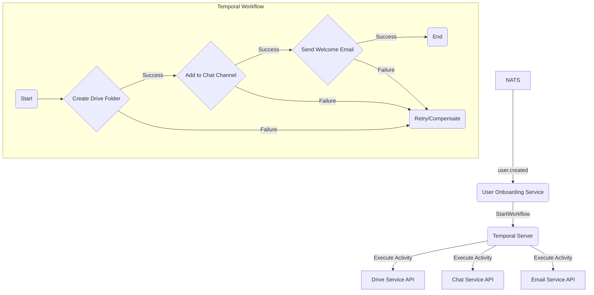

# Software Integration Plan

## 1. Introduction
This document outlines the strategy for integrating the various open-source components into a single, cohesive productivity platform. The goal is to create a seamless user experience where the boundaries between the different software components are invisible to the end-user.

## 2. Core Integration Principles
- **Unified User Identity:** All components will be integrated with ZITADEL to provide a single, unified user identity across the entire platform.
- **Consistent User Interface:** We will develop a common UI component library and design system to ensure a consistent look and feel across all applications.
- **Centralized API Gateway:** All inter-service communication and external API traffic will be routed through the Kong API Gateway.
- **Asynchronous Communication:** Where appropriate, we will use a message bus (e.g., NATS or RabbitMQ) for asynchronous communication between services to improve resilience and scalability.

## 3. Integration Strategy by Component

### 3.1. ZITADEL (Identity)
- **Integration:** All services will be configured to use ZITADEL as their OpenID Connect (OIDC) provider. The frontend applications will handle the OIDC redirect flow to authenticate users.
- **User Provisioning:** We will use ZITADEL's APIs to provision users and groups, and to manage their access rights to the various applications.

### 3.2. Mattermost (Chat)
- **Integration:** Mattermost will be deeply integrated with the other platform components. We will use Mattermost's plugin system to:
  - Create a custom authentication plugin to integrate with ZITADEL.
  - Develop plugins to receive notifications from other services (e.g., new tasks in Focalboard, new documents in the Drive).
  - Build "slash commands" to trigger actions in other services (e.g., `/meet` to start a new LiveKit video meeting).

### 3.3. LiveKit (Video)
- **Integration:** LiveKit's SDKs will be used to build a custom video conferencing UI within our web and mobile clients. The video conferencing service will be integrated with the Calendar for scheduling meetings and with Chat for starting ad-hoc meetings.

### 3.4. Custom Components (Email, Calendar, Docs, etc.)
- **Integration:** Our custom-built components will be designed from the ground up to be integrated with the rest of the platform. They will all use the same user identity, UI component library, and API gateway.

## 4. Workflow Orchestration with Temporal
For complex, long-running, and stateful business processes, we will use Temporal as our workflow orchestration engine. Temporal provides a "durable execution" model, ensuring that workflows run to completion, even in the face of service failures or outages.

**Example Workflow: User Onboarding**
The user onboarding process is a perfect use case for Temporal. It involves coordinating multiple services to set up a new user's account.

1.  **Trigger:** The workflow is triggered by a `user.created` event from NATS.
2.  **Orchestration:** A `UserOnboardingService` (acting as a Temporal Worker) starts the workflow.
3.  **Activities:** The workflow executes a series of "activities," which are the actual calls to other microservices:
    *   Create a root folder in the Drive Service.
    *   Add the user to a default "Welcome" channel in the Chat Service.
    *   Send a welcome email via the Email Service.

## 5. Data Integration
- **Universal Search:** OpenSearch will be used to index data from all services, providing a single search interface for users to find what they are looking for, regardless of where it is stored.
- **Analytics:** Data from all services will be ingested into our analytics pipeline (OpenTelemetry + ClickHouse + Apache Superset) to provide a holistic view of platform usage and user behavior.

## 6. Integration Testing
- **End-to-End Tests:** We will develop a suite of end-to-end tests (using a framework like Cypress or Playwright) to verify that the integrated platform works as expected.
- **Contract Testing:** We will use a contract testing framework (e.g., Pact) to ensure that the APIs between our services remain compatible.
