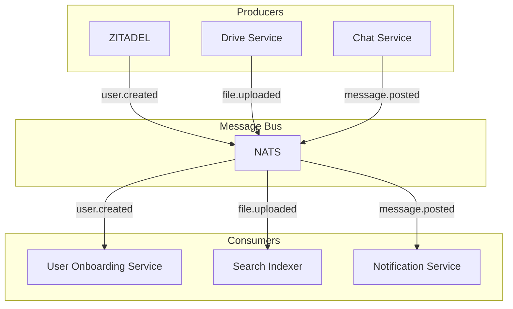

# Software Architecture Document

## 1. Introduction
This document provides a comprehensive overview of the software architecture for the permissive open-source productivity platform. It expands upon the initial technical blueprint, detailing the system's structure, components, and the technologies used to build them.

## 2. Architectural Goals and Constraints
The architecture is designed to be:
- **Highly Scalable:** Capable of supporting millions of users through horizontal and vertical scaling.
- **Secure:** Implementing security best practices at every layer.
- **Extensible:** Allowing for the addition of new features and proprietary extensions without compromising the core platform's permissive licensing.
- **Resilient:** Ensuring high availability and fault tolerance.
- **Maintainable:** Built with clean code principles and clear separation of concerns.

**Constraint:** All core components must use permissive licenses (Apache-2.0, MIT, BSD, ISC). Components with less permissive licenses (e.g., LGPL) may be used if they can be isolated at a service boundary.

## 3. System Architecture
The platform follows a microservices architecture. Each major functional area (e.g., Chat, Docs, Identity) is implemented as an independent service. These services communicate with each other via a combination of synchronous REST/gRPC APIs and asynchronous messaging. All external traffic is routed through an API Gateway (Kong).

### 3.1. Event-Driven Architecture with NATS
For asynchronous communication and to decouple services, the platform will use NATS as a lightweight, high-performance message bus. This allows services to publish events about significant state changes without needing to know which other services are interested in those events.

**Key Use Cases:**
- **User Onboarding:** When a new user is created in ZITADEL, a `user.created` event is published. Downstream services can then react to this event to provision necessary resources.
- **Notifications:** A central `Notification Service` can subscribe to various events (e.g., `chat.message.posted`, `calendar.event.upcoming`) to send emails or push notifications to users.
- **Search Indexing:** The `Drive Service` can publish a `file.uploaded` event, which a search indexing service can consume to keep the search index up-to-date.

### 3.2. Component Deep Dive
*(This section expands on the selections in the technical blueprint)*

- **Identity (ZITADEL):** ZITADEL will serve as the central identity provider, handling user authentication (OAuth 2.0, OpenID Connect), multi-factor authentication, and single sign-on (SSO). It will be the single source of truth for user identity.
- **Real-Time Communication (Mattermost & LiveKit):** Mattermost will provide the core chat functionality. For video meetings, LiveKit's SFU architecture will be used to efficiently route media streams. LiveKit's SDKs will be used to build a seamless video calling experience directly within the platform's web and mobile clients.
- **Document Collaboration (ProseMirror/TipTap + Yjs):** The front-end for document editing will be built using the ProseMirror framework (with TipTap for a friendlier API). Real-time collaboration will be powered by Yjs, a Conflict-free Replicated Data Type (CRDT) implementation, which ensures data consistency between clients. A dedicated websocket service will manage Yjs state synchronization. LibreOffice will be run as a headless service for robust import/export of ODF and Microsoft Office formats.
- **File Storage (SeaweedFS & OpenSearch):** SeaweedFS will provide the S3-compatible object storage backend. Its distributed nature allows for massive horizontal scalability. Resumable uploads will be handled client-side using the TUS protocol, with a small backend service to coordinate the uploads with SeaweedFS. OpenSearch will be used to index the content of files for a powerful, platform-wide search experience.

### 3.3. Exploration of Additional Technologies

- **WebKit (LGPL/BSD):**
  - **Use Case:** To create a cross-platform desktop application for the productivity suite. Frameworks like Electron or Tauri can embed WebKit (or its fork, Blink) to deliver a native-like experience, enabling features like offline access, deeper OS integration, and dedicated window management. This would be a key component for rivaling the Microsoft 365 desktop experience.
  - **Value:** Provides a consistent rendering engine across web and desktop, and unlocks native capabilities.
- **libnice (MPL 2.0/LGPL 2.1+):**
  - **Use Case:** While LiveKit's SFU is ideal for multi-party calls, `libnice` could be used to optimize one-on-one video calls by establishing a direct peer-to-peer (P2P) connection between the two clients. This would reduce server load and latency for the most common type of video call. It would be implemented as a fallback or optimization within the client-side WebRTC logic.
  - **Value:** Reduces server costs and improves performance for one-on-one communication.
- **Rygel (LGPL):**
  - **Use Case:** Rygel could be integrated into the Cloud Drive component as an optional, user-enabled media server. It would allow users to stream music, videos, and photos stored in their drive to DLNA/UPnP compatible devices on their local network, such as smart TVs or game consoles.
  - **Value:** Adds a consumer-friendly media sharing feature that enhances the value of the cloud storage offering.

## 4. Data Management
- **Primary Database (PostgreSQL):** PostgreSQL will be the relational database for the majority of the services. Its reliability, extensibility, and permissive license make it the ideal choice.
- **ORM Strategy:** For NodeJS services, we will use **Prisma** as our primary Object-Relational Mapper (ORM). Its type-safe client and declarative schema definition file (`schema.prisma`) align with our code generation and single-source-of-truth principles. Each service will manage its own schema and migrations.
- **Search & Analytics (OpenSearch & ClickHouse):** OpenSearch will be used for full-text search across all services. For telemetry and analytics data, ClickHouse will be used due to its high performance for OLAP queries.
- **Data Schemas:** Each microservice will own its own database schema, and will not be allowed to access the database of other services directly. This enforces service isolation.

## 5. Deployment and Infrastructure
The platform will be deployed on Kubernetes. A detailed DevOps and infrastructure plan is available in the `devops_solutions.md` document.
