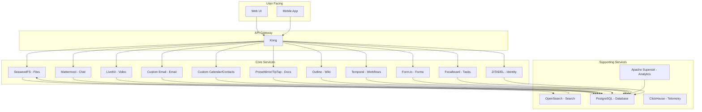

# Technical Blueprint for a Permissive Open-Source Productivity Platform

## 2. Component Selection and Justification

### Identity & SSO
* **Choice:** **ZITADEL**
* **Justification:** ZITADEL is a cloud-native identity management platform written in Go, offering excellent scalability and a modern, easy-to-integrate API. It provides a balance of features, scalability, and ease of use, making it a better choice than the more complex Keycloak or the more modular (but requiring more integration effort) Ory.

### Team Chat
* **Choice:** **Mattermost**
* **Justification:** Mattermost offers a familiar, Slack-like user experience, which is a significant advantage for user adoption. It's highly extensible, has strong enterprise features, and its Apache-2.0 license fits the permissive model.

### Video Meetings/Calls
* **Choice:** **LiveKit**
* **Justification:** LiveKit's SFU architecture is highly scalable and efficient for large meetings. It provides high-quality SDKs for various platforms, making it easier to build a custom, deeply integrated video conferencing experience.

### Email
* **Choice:** **OpenSMTPD/Haraka (SMTP), Dovecot (IMAP/LMTP), Rspamd (filtering), and a custom webmail UI using imapflow.**
* **Justification:** This is a proven, high-performance email stack. By building a custom webmail UI with the MIT-licensed imapflow library, we avoid the GPL-licensed Roundcube and maintain a fully permissive stack.

### Calendaring/Contacts
* **Choice:** **Custom microservice (Go/Node.js) with PostgreSQL.**
* **Justification:** Building a custom microservice for calendaring and contacts allows for a fully permissive solution, avoiding GPL-licensed CalDAV servers. A GraphQL API will provide a flexible data layer for the frontend, and a REST API will handle ICS/vCard sync.

### Cloud Drive/File Sync
* **Choice:** **SeaweedFS (object store), TUS (resumable uploads), and OpenSearch (content search).**
* **Justification:** SeaweedFS is a highly scalable and performant object store. The TUS protocol is essential for a good user experience with large files, and OpenSearch provides powerful content indexing and search capabilities.

### Docs/Sheets/Slides
* **Choice:** **A hybrid approach: ProseMirror/TipTap + Yjs for real-time collaboration, Luckysheet/Slidev for spreadsheets and presentations, and LibreOffice for import/export.**
* **Justification:** This hybrid approach provides the best of both worlds: a modern, real-time collaborative editor for most use cases, and full compatibility with Microsoft Office formats via LibreOffice's powerful conversion tools.

### Wikis/Knowledge Base
* **Choice:** **Outline**
* **Justification:** Outline is a modern, feature-rich knowledge base with a beautiful UI. It supports real-time collaboration, SSO, and RBAC, and its BSD-3-Clause license is permissive.

### Automation/Workflows
* **Choice:** **Temporal**
* **Justification:** Temporal is a powerful, MIT-licensed workflow engine that is highly scalable and reliable. It's an excellent alternative to AGPL solutions and can be extended with a custom visual builder.

### Forms
* **Choice:** **Form.io**
* **Justification:** Form.io's community edition provides a powerful, permissive-licensed form builder that can be easily integrated into the platform.

### Search
* **Choice:** **OpenSearch**
* **Justification:** For a horizontally scalable platform, OpenSearch is the best choice. It can handle large amounts of data and provides advanced search features.

### Analytics/Dashboards
* **Choice:** **Apache Superset**
* **Justification:** Apache Superset is a modern, enterprise-ready BI tool with a permissive Apache-2.0 license. It's a great alternative to AGPL solutions like Metabase.

### Tasking/PM
* **Choice:** **Focalboard**
* **Justification:** Focalboard is a feature-rich project management tool that is part of the Mattermost ecosystem. Its Apache-2.0 license and self-hosted nature make it a perfect fit for the platform.

## 3. Architectural Design

### Integration & Extensibility

The platform is designed with a microservices architecture, where each component is a separate service that communicates with others over well-defined APIs (REST, gRPC). This allows for independent development, deployment, and scaling of each component.

Proprietary features can be added by building separate microservices that interact with the core components via their APIs. This "service boundary isolation" pattern ensures that the core platform remains permissively licensed, while allowing for the development of value-added, proprietary extensions.

### DevOps & Infrastructure

*   **API Orchestration:** **Kong** will be used as the API gateway, providing a single entry point for all API traffic. Kong will handle authentication, rate-limiting, and other cross-cutting concerns.
*   **Database:** **PostgreSQL** will be the primary database for all components that require a relational database.
*   **Telemetry:** **OpenTelemetry** will be used for collecting and exporting telemetry data (metrics, traces, and logs). This data will be sent to a custom dashboard built on **ClickHouse**.
*   **Deployment:** The entire platform will be deployed on **Kubernetes**, allowing for automated scaling, self-healing, and rolling updates.

## 4. Deliverables

### Component Dependency Diagram

### License Compliance Matrix

| Component | License |
|---|---|
| ZITADEL | Apache-2.0 |
| Mattermost | Apache-2.0 |
| LiveKit | Apache-2.0 |
| OpenSMTPD | ISC |
| Haraka | MIT |
| Dovecot | MIT/LGPL-2.1 |
| Rspamd | Apache-2.0 |
| imapflow | MIT |
| SeaweedFS | Apache-2.0 |
| TUS | MIT |
| OpenSearch | Apache-2.0 |
| ProseMirror/TipTap | MIT |
| Yjs | MIT |
| Luckysheet | MIT |
| Slidev | MIT |
| Outline | BSD-3-Clause |
| Temporal | MIT |
| Form.io | MIT |
| Apache Superset | Apache-2.0 |
| Focalboard | Apache-2.0 |
| Kong | Apache-2.0 |
| PostgreSQL | PostgreSQL License |
| OpenTelemetry | Apache-2.0 |
| ClickHouse | Apache-2.0 |

### Deployment Architecture

The platform will be deployed on a Kubernetes cluster. Each component will be deployed as a separate set of pods, with a corresponding service and ingress. A Helm chart will be created to automate the deployment of the entire platform.

### Extensibility Roadmap

1.  **Custom Connectors:** Develop a framework for building custom connectors to third-party services (e.g., Salesforce, Jira).
2.  **Marketplace:** Create a marketplace for sharing and selling community-developed extensions.
3.  **Advanced Features:** Develop proprietary, value-added features as separate microservices (e.g., advanced analytics, AI-powered document analysis).

### Security Hardening Checklist

*   **SSO Integration:** All components will be integrated with ZITADEL for single sign-on.
*   **Encryption at Rest:** All data stored in PostgreSQL and SeaweedFS will be encrypted at rest.
*   **Encryption in Transit:** All communication between services will be encrypted using TLS.
*   **RBAC:** Role-based access control will be implemented in all components to ensure that users can only access the data and features they are authorized to.
